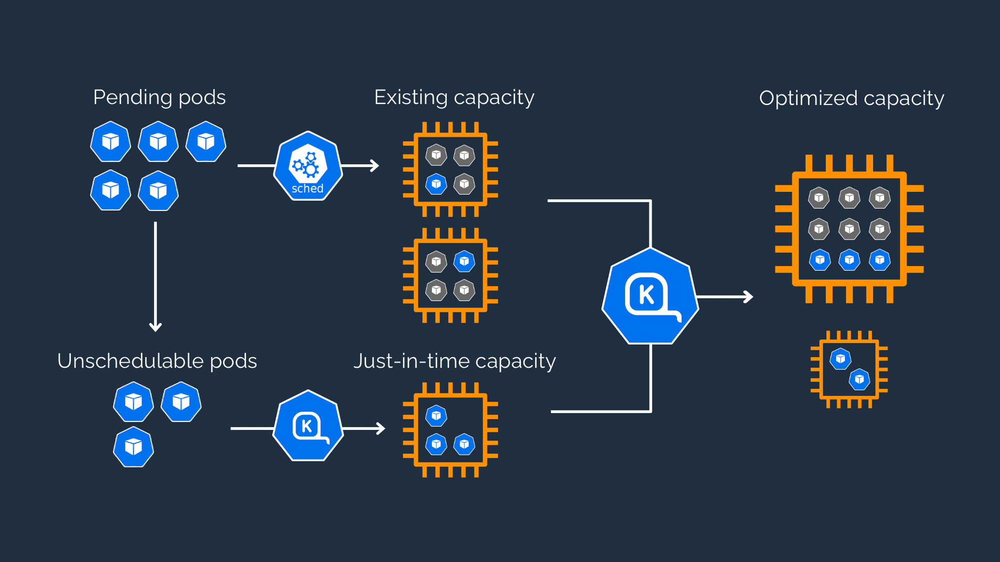

# Karpenter

Karpenter Docs

- [Documentation](https://karpenter.sh/docs/)
- [GitHub](https://github.com/aws/karpenter)

### Releases
```text
2023-09-22: v0.30.0
2023-08-29: v0.29.2
```

Karpenter는 적시에 적절한 노드로 Kubernetes 인프라를 단순화합니다.

Karpenter는 클러스터의 애플리케이션을 처리하는 데 적합한 컴퓨팅 리소스만 자동으로 시작합니다. Kubernetes 클러스터를 위한 빠르고 간단한 컴퓨팅 프로비저닝으로 클라우드를 최대한 활용할 수 있도록 설계되었습니다.

### **애플리케이션 가용성 향상**

Karpenter는 애플리케이션 로드, 일정 및 리소스 요구 사항의 변화에 신속하고 자동으로 대응하여 사용 가능한 다양한 컴퓨팅 리소스 용량에 새로운 워크로드를 배치합니다.

### **컴퓨팅 비용 절감**

Karpenter는 활용도가 낮은 노드를 제거하고 값비싼 노드를 저렴한 대안으로 교체하고 워크로드를 보다 효율적인 컴퓨팅 리소스로 통합할 수 있는 기회를 찾아 클러스터 컴퓨팅 비용을 낮춥니다.

### **운영 오버헤드 최소화**

Karpenter는 쉽게 사용자 정의할 수 있는 단일 선언적 리소스에 독자적인 기본값 세트와 함께 제공됩니다 **`Provisioner`**.

## **작동 방식**



Karpenter는 예약되지 않은 포드의 총 리소스 요청을 관찰하고 예약 대기 시간과 인프라 비용을 최소화하기 위해 노드를 시작하고 종료하는 결정을 내립니다.

## **structures**
- base
  - manifest
  - crd
  - aws-note-templates
  - provisioners
- duplicated-spot
  - provisioners
- init-provisioning
  - (CAS에서 Karpenter로 migration시 안정적인 Pod 전환을 위한 항목)
- over-provisioning
  - (서비스의 고가용성 확보 및 업타임 속도 개선을 위한 항목)
    - ex. pod uptime 60~70s -> 10~15s
- overlays
  - envs(dev, staging)
    - patches
      - common ...
      - provisioners/
    - specific
      - add custom

#### karpenter kustomize의 provisioner는 다음의 목적성을 가진 NodeGroups에 대해 정의합니다.
  - default
  - service
  - monitoring
  - cicd
  - system-critical

## **role binding**
Karpenter를 사용하기 위한 Cluster, Node Role을 설정해야 합니다.
- ex.
    - KarpenterControllerRole-lyon-cluster-platform
    - KarpenterNodeRole-lyon-cluster-platform
- [Migrating from Cluster Autoscaler 참조](https://karpenter.sh/docs/getting-started/migrating-from-cas/)
  - 설정을 위한 scripts는 DevOps에서 관리
    - 관련 스크립트 코드는 git secret을 적용하여 관리합니다.
      - karpenter-role.sh.secret

추가로 Karpenter가 권한을 획득하기 위해 aws-auth.yaml에 role을 추가해주어야 합니다.
- ex.
  ```yaml
  - groups:
    - system:bootstrappers
    - system:nodes
    rolearn: arn:aws:iam::XXXXXXXX:role/KarpenterNodeRole-lyon-cluster-platform
    username: system:node:{{EC2PrivateDNSName}}
  ```

## **pre-settings**
클러스터별 노드의 활용에 따른 Provisioner spec을 정의해주어야 합니다.
관련 내용은 karpenter/overlays/platform/patches/provisioners에서 확인 할 수 있습니다.
- ex. 
  ```yaml
  apiVersion: karpenter.sh/v1alpha5
  kind: Provisioner
  metadata:
    name: default
  spec:
    requirements:
      - key: karpenter.k8s.aws/instance-family
        operator: In
        values: [ t3, t3a ]
      - key: karpenter.k8s.aws/instance-size
        operator: In
        values: [ medium, large ]
      - key: topology.kubernetes.io/zone
        operator: In
        values: [ ap-northeast-2a, ap-northeast-2c ]
      - key: eks.amazonaws.com/nodegroup
        operator: In
        values: [ default, platform, lyon-gateway ]
      - key: capacity-spread # karpenter.sh/capacity-type = on-demand (default)
        operator: In
        values: [ "on-demand-1", "on-demand-2" ]
    ttlSecondsUntilExpired: 604800
    ttlSecondsAfterEmpty: 30
    weight: 10
    providerRef:
      name: lyon-cluster
  ```
## **get started**
```bash
kubectl apply -k platform
kubectl apply -k staging
```
