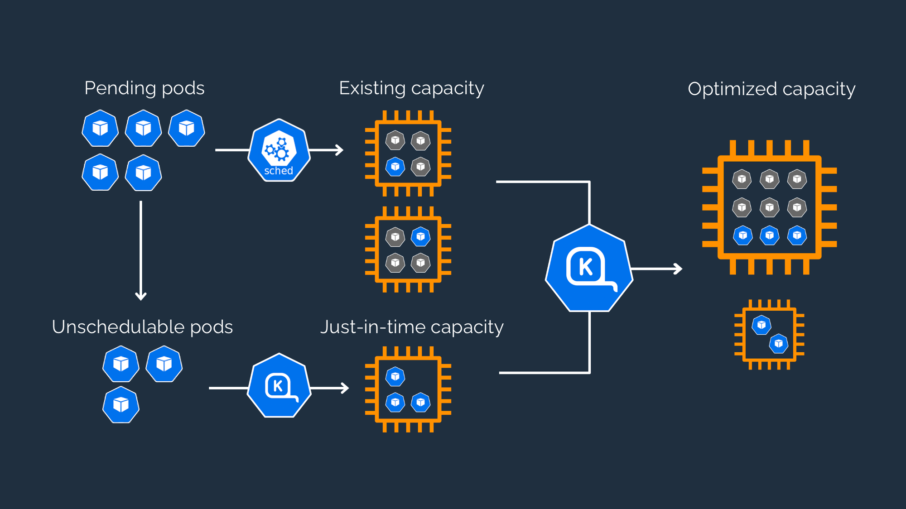

# Karpenter

Karpenter Docs

- [Documentation](https://karpenter.sh/docs/)
- [GitHub](https://github.com/aws/karpenter)

### Releases
```text
2026-04-03: 1.8.6
2025-01-07: 0.36.2
2024-08-19: v0.33.6
2024-08-12: v0.32.10 by terraform
2024-05-27: v0.32.10
2024-01-30: v0.31.4
2023-09-22: v0.30.0
2023-08-29: v0.29.2
```

Karpenter는 적시에 적절한 노드로 Kubernetes 인프라를 단순화합니다.

Karpenter는 클러스터의 애플리케이션을 처리하는 데 적합한 컴퓨팅 리소스만 자동으로 시작합니다. Kubernetes 클러스터를 위한 빠르고 간단한 컴퓨팅 프로비저닝으로 클라우드를 최대한 활용할 수 있도록 설계되었습니다.

### **애플리케이션 가용성 향상**

Karpenter는 애플리케이션 로드, 일정 및 리소스 요구 사항의 변화에 신속하고 자동으로 대응하여 사용 가능한 다양한 컴퓨팅 리소스 용량에 새로운 워크로드를 배치합니다.

### **컴퓨팅 비용 절감**

Karpenter는 활용도가 낮은 노드를 제거하고 값비싼 노드를 저렴한 대안으로 교체하고 워크로드를 보다 효율적인 컴퓨팅 리소스로 통합할 수 있는 기회를 찾아 클러스터 컴퓨팅 비용을 낮춥니다.

### **운영 오버헤드 최소화**

Karpenter는 쉽게 사용자 정의할 수 있는 단일 선언적 리소스에 독자적인 기본값 세트와 함께 제공됩니다 **`NodePool`**.

## **작동 방식**



Karpenter는 예약되지 않은 포드의 총 리소스 요청을 관찰하고 예약 대기 시간과 인프라 비용을 최소화하기 위해 노드를 시작하고 종료하는 결정을 내립니다.

---
### Directory Structure

```
autoscaling/karpenter/
├── base/
│   ├── nodegroups.yaml                    # Base nodegroup definitions
│   └── charts/nodegroups/
│       ├── Chart.yaml
│       └── templates/resources.yaml       # Helm template for generating resources
└── overlays/
    ├── prod/
    │   ├── kustomization.yaml
    │   └── patches/patch-nodegroups.yaml  # specific configurations
    ├── dev/
    │   ├── kustomization.yaml
    │   └── patches/patch-nodegroups.yaml  # specific configurations
    └── [other-envs]/
        ├── kustomization.yaml
        └── patches/patch-nodegroups.yaml
```

## Configuration Structure

### 1. baseNodeGroups (base/nodegroups.yaml)

환경에 무관한 공통 nodegroup 정의를 포함합니다.

```yaml
baseNodeGroups:
  - name: standard-services
    services: [
      "a-service", "b-service", "c-service", 
      # ... 기타 표준 서비스들
    ]
    storage:
      volumeSize: 20Gi

  - name: default
    services: ["default"]
    storage:
      volumeSize: 30Gi
  
  # ... 기타 시스템 nodegroup들
```

### 2. envNodeGroups (overlays/*/patches/patch-nodegroups.yaml)

환경별 특화 설정과 추가 nodegroup을 정의합니다.

```yaml
envNodeGroups:
  # Base nodegroup 오버라이드
  - name: standard-services
    nodeclass:
      baseName: my-cluster-ebs20
    requirements:
      - key: karpenter.k8s.aws/instance-category
        operator: In
        values: ["m"]
    taints:
      - effect: NoSchedule
        key: system-type
        value: service

  # 환경별 추가 nodegroup
  - name: cpu-optimized-ebs20
    services: ["cpu-1"]
    storage:
      volumeSize: 20Gi
    # ... 기타 설정
```

### 3. Merge values

Helm 템플릿이 다음 순서로 설정을 병합합니다:

1. **Base + Env 병합**: 동일한 `name`을 가진 nodegroup은 env 설정이 base 설정을 오버라이드
2. **Env 전용 추가**: env에만 존재하는 nodegroup은 그대로 추가
3. **리소스 생성**: 각 서비스별로 개별 NodePool과 EC2NodeClass 생성

```yaml
# 병합 결과 예시
merged_nodegroup = merge(envNodeGroups[name], baseNodeGroups[name])
```

## **installation**

### 1. terraform install
```bash
terraform init
AWS_PROFILE={{YOUR_AWS_PROFILE}} terraform apply -auto-approve
# TODO overlays/platform/kustomization.yaml의 resources field를 제거해야 합니다.
# nodepool, ec2nc apply
kustomize build ./overlays/platform --enable-helm --load-restrictor=LoadRestrictionsNone | kubectl apply -f -
```

### 2. kustomize install
```bash
kustomize build ./overlays/platform --enable-helm --load-restrictor=LoadRestrictionsNone | kubectl apply -f -
```
