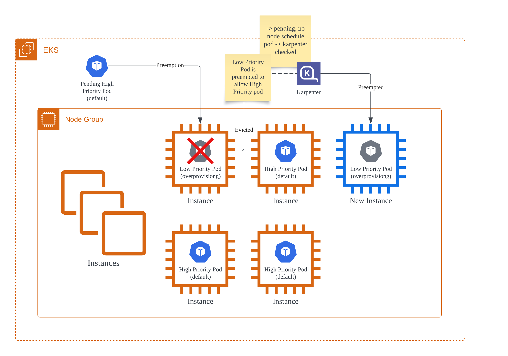

## OverProvisioning




```bash
kubectl apply -k over-provisioning/setup/platform
```

### 참조
 - [eks-workshop-v2/overprovisioning](https://github.com/aws-samples/eks-workshop-v2/blob/latest/manifests/modules/autoscaling/compute/overprovisioning/setup/kustomization.yaml) 
 - [Karpenter와 Empty Pod을 활용한 스케일링(2)](https://medium.com/uplusdevu/karpenter%EC%99%80-empty-pod%EC%9D%84-%ED%99%9C%EC%9A%A9%ED%95%9C-%EC%8A%A4%EC%BC%80%EC%9D%BC%EB%A7%81-2-cb8abbc28911)